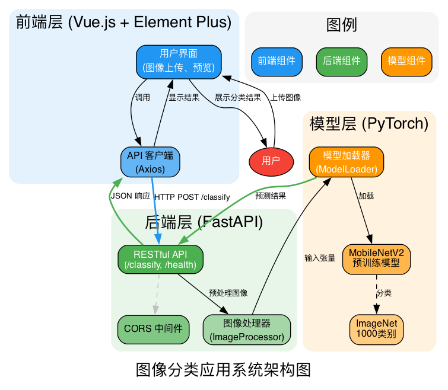

# 图像分类应用

基于 Vue.js 和 FastAPI 的前后端分离图像分类应用，使用 PyTorch MobileNetV2 预训练模型进行图像识别。

## 项目架构



### 技术栈

**前端：**
- Vue.js 3 - 响应式前端框架
- Axios - HTTP 客户端
- HTML5/CSS3 - 现代化 UI 设计

**后端：**
- FastAPI - 高性能 Web 框架
- Uvicorn - ASGI 服务器
- PyTorch - 深度学习框架
- MobileNetV2 - 预训练图像分类模型

## 项目结构

```
image-classification-app/
├── backend/                 # 后端服务
│   ├── main.py             # FastAPI 主应用
│   ├── model.py            # 图像分类模型
│   ├── test_api.py         # 单元测试
│   ├── requirements.txt     # Python 依赖
│   ├── imagenet_classes.txt # ImageNet 类别标签
│   └── download_classes.py # 下载类别标签脚本
├── frontend/               # 前端应用
│   └── index.html          # Vue.js 单页应用
├── architecture_diagram.png # 系统架构图
└── README.md              # 项目文档
```

## 功能特性

### 前端功能
- 📁 图片上传（支持点击和拖拽）
- 🖼️ 图片实时预览
- 🎯 分类结果展示（Top 5 预测）
- �加载状态和错误提示
- 🎨 响应式设计，美观的 UI

### 后端功能
- 🚀 RESTful API 接口
- 📤 图片上传处理
- 🧠 MobileNetV2 模型推理
- 📊 返回分类结果和置信度
- 🔒 CORS 支持
- 💚 健康检查接口

## 安装和运行

### 后端设置

1. 进入后端目录：
```bash
cd backend
```

2. 安装依赖：
```bash
pip install -r requirements.txt
```

3. 下载 ImageNet 类别标签（如果需要）：
```bash
python download_classes.py
```

4. 启动后端服务：
```bash
python main.py
```

后端服务将在 `http://localhost:8000` 启动。

### 前端设置

1. 进入前端目录：
```bash
cd frontend
```

2. 启动前端服务：
```bash
python -m http.server 3000
```

前端应用将在 `http://localhost:3000` 启动。

## API 接口

### GET /
获取 API 信息

**响应示例：**
```json
{
  "message": "欢迎使用图像分类 API",
  "endpoints": {
    "health": "/health",
    "predict": "/predict"
  }
}
```

### GET /health
健康检查接口

**响应示例：**
```json
{
  "status": "healthy",
  "service": "image-classification-api"
}
```

### POST /predict
图像分类接口

**请求：**
- Content-Type: multipart/form-data
- file: 图片文件（支持 JPG, PNG, GIF, BMP, WebP）

**响应示例：**
```json
{
  "predictions": [
    {
      "class": "Samoyed",
      "confidence": 0.8303
    },
    {
      "class": "Pomeranian",
      "confidence": 0.0699
    }
  ],
  "top_prediction": {
    "class": "Samoyed",
    "confidence": 0.8303
  }
}
```

## 测试

### 单元测试

运行后端单元测试：
```bash
cd backend
pytest test_api.py -v
```

测试包括：
- 根路径测试
- 健康检查测试
- 图像分类测试
- 文件类型验证测试
- 错误处理测试

### 集成测试

1. 启动后端服务（端口 8000）
2. 启动前端服务（端口 3000）
3. 访问 `http://localhost:3000`
4. 上传测试图片验证功能

测试图片示例：
- https://github.com/pytorch/hub/raw/master/images/dog.jpg

## 使用示例

### 使用 curl 测试 API

```bash
curl -X POST -F "file=@test_image.jpg" http://localhost:8000/predict
```

### 使用 Python 测试 API

```python
import requests

with open("test_image.jpg", "rb") as f:
    response = requests.post(
        "http://localhost:8000/predict",
        files={"file": f}
    )
    result = response.json()
    print(f"预测结果: {result['top_prediction']['class']}")
    print(f"置信度: {result['top_prediction']['confidence']:.2%}")
```

## 性能说明

- 模型：MobileNetV2（轻量级，适合实时推理）
- 输入尺寸：224x224
- 推理时间：约 100-500ms（取决于硬件）
- 支持的图片格式：JPG, JPEG, PNG, BMP, GIF, WebP

## 注意事项

1. 首次运行时会自动下载 MobileNetV2 预训练模型（约 14MB）
2. 模型使用 ImageNet 1000 类别进行分类
3. 建议使用 GPU 加速推理（自动检测 CUDA）
4. 前端需要后端服务运行才能正常工作

## 许可证

MIT License

## 贡献

欢迎提交 Issue 和 Pull Request！
